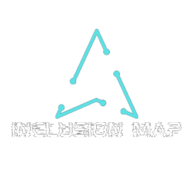

<div align="center">

  

  # 🗺️ Inclusion Map

  **Plataforma de mapeamento, inclusão e visibilidade para Pessoas com Deficiência (PCD).**

  [](#-executando-com-docker)
  [](https://nodejs.org/)
  [](https://getbootstrap.com/)
  [](LICENSE)

</div>

---

## 📌 Sobre o Projeto

O **Inclusion Map** é uma solução web desenvolvida para dar voz e visibilidade às Pessoas com Deficiência (PCD) no município de **Jaraguá do Sul**. 

A plataforma permite que os cidadãos se cadastrem, informem as suas necessidades de acessibilidade e contribuam para o mapeamento de demandas da cidade, ajudando na gestão pública e na criação de políticas de inclusão eficientes.

### 🚀 Principais Funcionalidades
- 👤 **Registo e Perfil de Cidadãos**: Gestão individual de dados e necessidades de acessibilidade.
- 📋 **Painel Administrativo (ADM)**: Visualização, filtragem e gestão completa de todos os registos.
- ♿ **Mapeamento de Necessidades**: Diagnóstico rápido de dificuldades enfrentadas na comunidade.
- 🎨 **Interface Acessível e Responsiva**: Design adaptado a diferentes dispositivos com suporte a componentes modernos.

---

## 🛠️ Tecnologias Utilizadas

- **Backend**: Node.js, Express, Handlebars (Template Engine)
- **Frontend**: HTML5, CSS3, JavaScript (ES6+), Bootstrap 5, FontAwesome
- **Containerização**: Docker, Docker Compose

---

## 🐳 Executando com Docker

### 🛠️ Pré-requisitos
Certifica-te de que tens as seguintes ferramentas instaladas no teu sistema:
* [Docker Desktop](https://www.docker.com/products/docker-desktop/)
* [Docker Compose](https://docs.docker.com/compose/)

---

### 🚀 Passo a Passo

1. **Clona o repositório:**
   ```bash
   git clone [https://github.com/teu-usuario/inclusion-map.git](https://github.com/teu-usuario/inclusion-map.git)
   cd inclusion-map